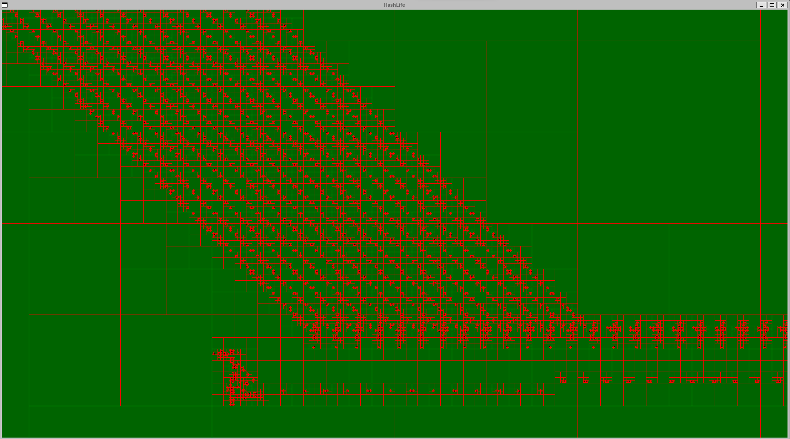
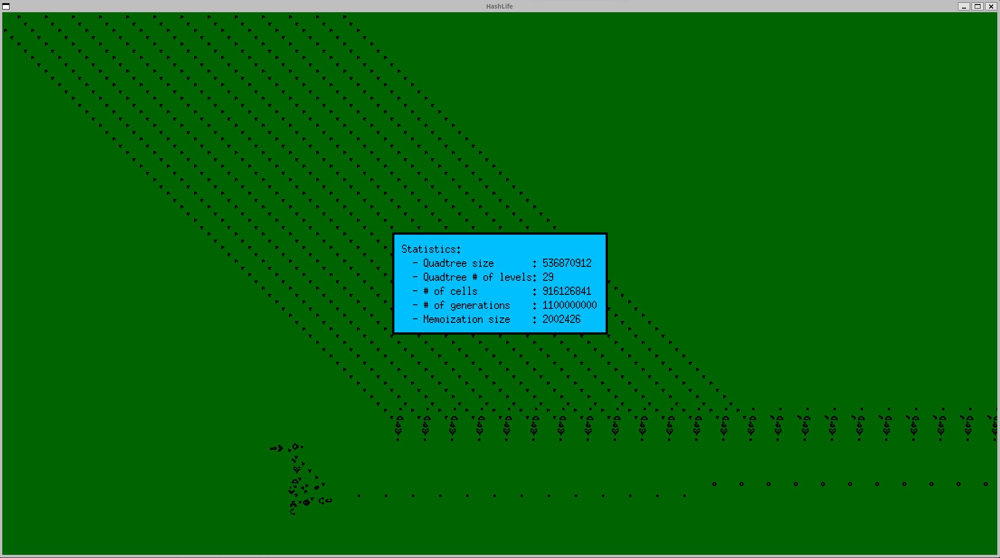

# Hashlife Algorithm for Conway [Game of Life](https://en.wikipedia.org/wiki/Conway%27s_Game_of_Life)

I wrote this code to understand the very cool Hashlife algorithm by Bill Gosper: [Exploiting Regularities in Large Cellular Spaces](https://www.lri.fr/~filliatr/m1/gol/gosper-84.pdf).
Resources:

* [Dr.Dobb's article](https://www.drdobbs.com/jvm/an-algorithm-for-compressing-space-and-t/184406478).
* [Hashlife in python with explanations](https://johnhw.github.io/hashlife/index.md.html).

The 10000 feet view of this algorithm is that you don't have to keep the coordinates of each cells, you can arrange the cells in a [quadtree](https://en.wikipedia.org/wiki/Quadtree) (from this quadtree you can get the coordinates of each cells by placing the lower left corner, for example, of the quadtree where you want). There will be a lot of quadrants with the same configuration of cells so you can avoid a lot of computations by using [memoization](https://en.wikipedia.org/wiki/Memoization).

To execute
```bash
dune exec ./hashlife.exe
```



